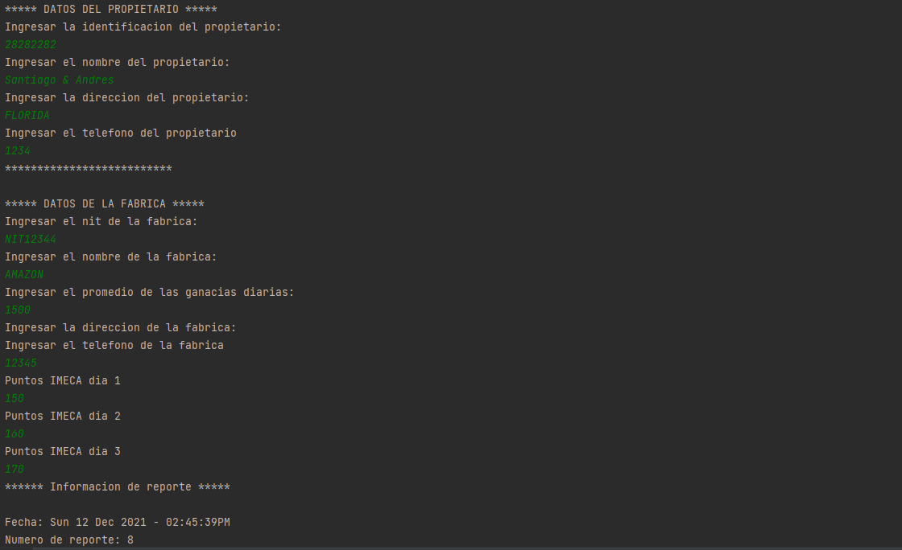
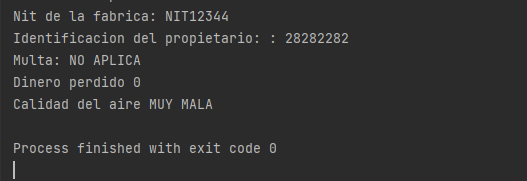

# Actividad 4

Una fábrica ha sido sometida a un programa de control de contaminación para lo cual se efectúa una revisión de los puntos IMECA (índice metropolitano de la calidad del aire) generados por la fábrica. El programa de control de contaminación consiste en medir los puntos IMECA que emite la fábrica en tres días de una semana y si el promedio es superior a los 170 puntos entonces tendrá la sanción de parar su producción por una semana y una multa del 50% de las ganancias diarias cuando no se detiene la producción. Si el promedio obtenido de puntos IMECA es de 170 o menor entonces no tendrá ni sanción ni multa. El dueño de la fábrica desea saber cuánto dinero perderá después de ser sometido a la revisión.

Para reportar la calidad del aire, el índice emplea cinco categorías:

- BUENA. Cuando el índice se encuentra entre 0 y 50 puntos IMECA, la calidad del aire se considera como satisfactoria y la contaminación del aire tiene poco o nulo riesgo para la salud.

- REGULAR. Cuando el índice se encuentra entre 51 y 100 puntos IMECA, la calidad del aire es aceptable, sin embargo, algunos contaminantes pueden tener un efecto moderado en la salud para un pequeño grupo de personas que presentan una gran sensibilidad a algunos.

- MALA. Cuando el índice se encuentra entre 101 y 150 puntos IMECA, algunos grupos sensibles pueden experimentar efectos en la salud. Hay algunas personas que pueden presentar efectos a concentraciones menores que el resto de la población, como es el caso de personas con problemas respiratorios o cardíacos, los niños y ancianos. El público en general puede no presentar riesgos cuando el Imeca está en este intervalo.

- MUY MALA. Cuando el índice se encuentra entre 151 y 200 puntos (IMECA), toda la población experimenta efectos negativos en la salud. Los miembros de grupos sensibles pueden presentar molestias graves. En este intervalo se activan las Fases de Precontingencia y Contingencia Fase I del Programa de Contingencias Ambientales Atmosféricas.

- EXTREMADAMENTE MALA. Cuando el valor del índice es mayor a 201 puntos (IMECA), la población en general experimenta problemas graves de la salud.

Se requiere de un programa en C++ orientado a objetos que realice los cálculos anteriormente expuestos.  De la fábrica se conoce el nit, nombre, dirección, teléfono, promedio de ganancias diarias, las tres mediciones y la identificación del propietario. Del propietario se conoce la identificación, nombre, dirección y teléfono.  El reporte IMECA debe contener su número, nit de la fábrica evaluada, identificación del propietario, fecha, multa y el reporte de la calidad del aire.

