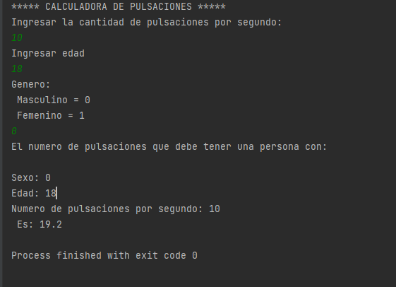

- Calcular el número de pulsaciones que debe tener una persona por cada 10 segundos de ejercicio aeróbico;
- la fórmula que se aplica cuando el sexo es femenino es:  numPulsaciones = ``(220 − edad)/10``.
si el sexo es masculino:   numPulsaciones = ``(210 − edad)/10``

# Output

