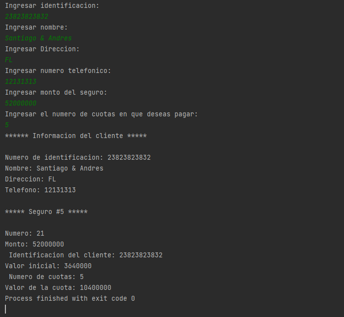

# Actividad 6

Una compañía de seguros necesita un programa en C++ para procesar la información de sus clientes y sus seguros lo cual consiste en lo siguiente:

Si el monto del seguro es menor de $50.000.000, el
valor inicial a pagar será del 3% del monto del seguro, y si el monto es a partir de
$50.000.000 la cuota a pagar será el 7% del monto. En ambos casos el cliente
determina en cuantas cuotas desea pagar el valor restante del seguro; el programa
deberá leer los datos del cliente: identificación, nombre, dirección y teléfono. Además, los datos del seguro: Número del seguro, monto del seguro, identificación del cliente, valor inicial, número de cuotas y valor de la cuota.

## Example Output

