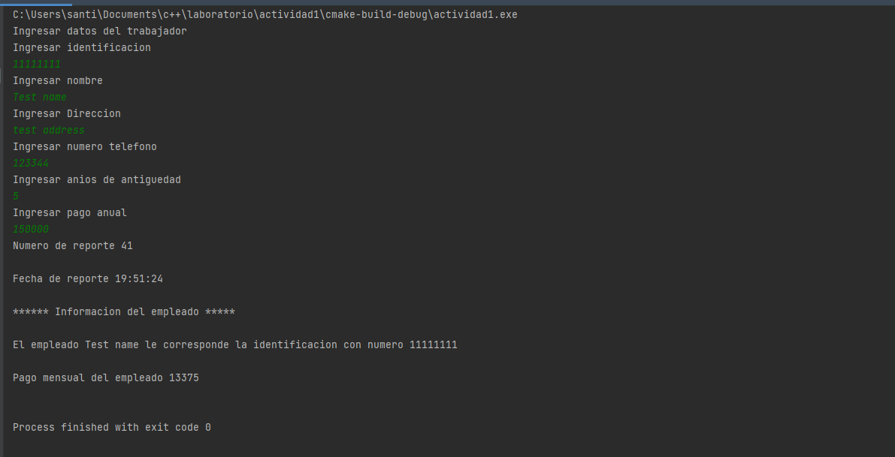

# Descripción del problema

Diseñar un programa en C++ orientado a objetos que genere un reporte del pago mensual que le corresponde al trabajador de una empresa que cobra $15.000.000 anuales, El reporte deberá contener su número de reporte, fecha, identificación del trabajador y su pago mensual. También se conoce los datos del trabajador: identificación, nombre, dirección, teléfono y años de antigüedad en la empresa. el programa debe realizar los cálculos en función de los siguientes criterios:

- Si lleva 10 años o más en la empresa se le aplica un aumento del 10% sobre su pago mensual.
-	Si su antigüedad es mayor o igual a 5 años y menor a 10 años, se le aplica un aumento del 7% sobre su pago mensual.
-	Si su antigüedad es mayor o igual a 3 años y menor a 5 años se le aplica un aumento del 5% sobre su pago mensual.
-	Si su antigüedad es mayor o igual a 1 año y menor a 3 años se le aplica un aumento del 3% sobre su pago mensual.

Output:

