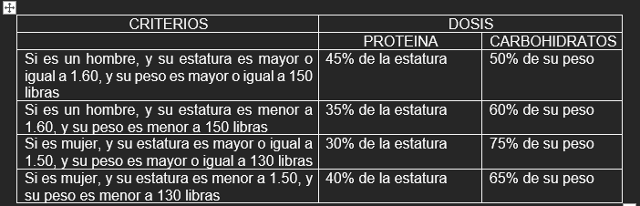
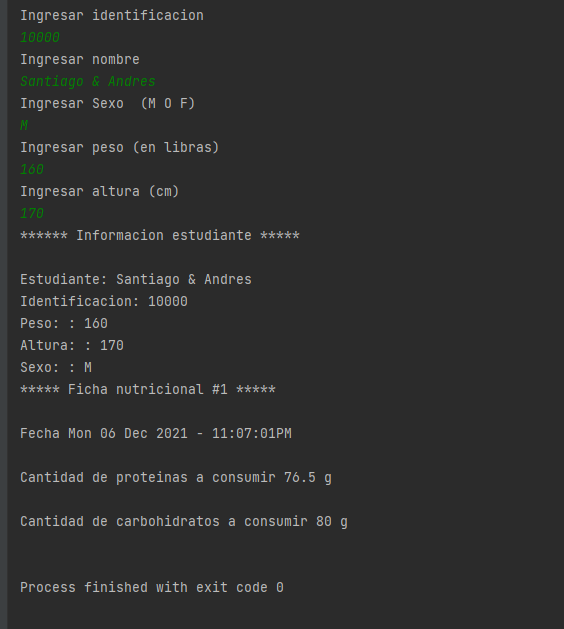

# Actividad 2

Construir un programa en C++ orientado a objetos que permita leer de un estudiante la identificación, el nombre, el
peso, la altura y el sexo. El programa deberá generar una ficha nutricional con su código de ficha, fecha y la cantidad
de proteínas y carbohidratos que deben consumir los estudiantes, con base al siguiente criterio

La dosis debe de ser expresada en gramos.

### Output:

